# How to Run QTA Prompt Files in VSCode

This guide explains how to use VSCode and GitHub Copilot to automate the creation and management of Quran Tadabbor Wa Aamal (QTA) quiz files. The process utilizes prompt files to instruct the AI agent to perform specific tasks related to generating and updating quiz content.

## Table of Contents

- [How to Run QTA Prompt Files in VSCode](#how-to-run-qta-prompt-files-in-vscode)
  - [Table of Contents](#table-of-contents)
  - [Introduction](#introduction)
  - [Converting HTML Forms to Quiz Files](#converting-html-forms-to-quiz-files)
    - [Step 1: Copy HTML from Google Forms](#step-1-copy-html-from-google-forms)
    - [Step 2: Prepare the HTML in VSCode](#step-2-prepare-the-html-in-vscode)
    - [Step 3: Open GitHub Copilot Chat](#step-3-open-github-copilot-chat)
    - [Step 4: Run the Prompt File](#step-4-run-the-prompt-file)
    - [Step 5: Review AI Response](#step-5-review-ai-response)
    - [Step 6: Check the Generated Markdown File](#step-6-check-the-generated-markdown-file)
    - [Step 7: Check the Generated CSV File](#step-7-check-the-generated-csv-file)
  - [Generating Quiz Questions from Book Content](#generating-quiz-questions-from-book-content)
    - [Step 1: Copy Content from a QTA Book](#step-1-copy-content-from-a-qta-book)
    - [Step 2: Prepare the Book Content](#step-2-prepare-the-book-content)
    - [Step 3: Run the Content Generation Prompt](#step-3-run-the-content-generation-prompt)
    - [Step 4: Check the Generated Markdown File](#step-4-check-the-generated-markdown-file)
    - [Step 5: Check the Generated CSV File](#step-5-check-the-generated-csv-file)
  - [Updating the Main Quiz Files](#updating-the-main-quiz-files)
    - [Step 1: Run the Update Prompt](#step-1-run-the-update-prompt)
    - [Step 2: Check the Updated Markdown File](#step-2-check-the-updated-markdown-file)
    - [Step 3: Check the Updated CSV File](#step-3-check-the-updated-csv-file)
  - [Tips and Best Practices](#tips-and-best-practices)


## Introduction

The QTA dataset is generated and maintained using GitHub Copilot with custom prompt files. These prompt files contain instructions for the AI agent to:
- Convert HTML quiz questions from Google Forms to properly formatted Markdown and CSV files
- Generate new quiz questions based on book content.specstory\history\2025-05-10-VSCode-Prompt-File-Generation-Task-Chat.md
- Update the main quiz files with content from sub-quizzes

> **Note:** The examples shown in this guide use dummy content for demonstration purposes. The actual content in the files mentioned (`quiz-3.html`, `book-content-4.md`, etc.) might be different now, as the original examples were created solely for documentation purposes.

## Converting HTML Forms to Quiz Files

### Step 1: Copy HTML from Google Forms
Copy the HTML content from a Google Form that contains quiz questions.

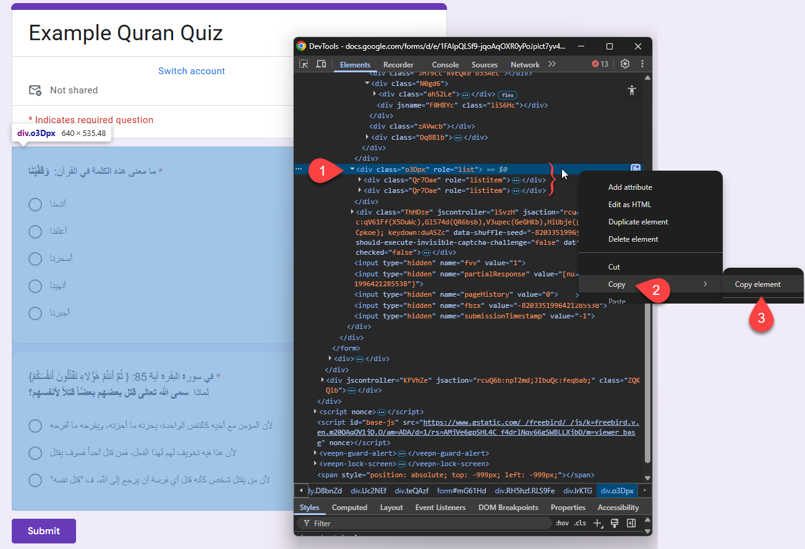

### Step 2: Prepare the HTML in VSCode
Paste and format the HTML content in VSCode.

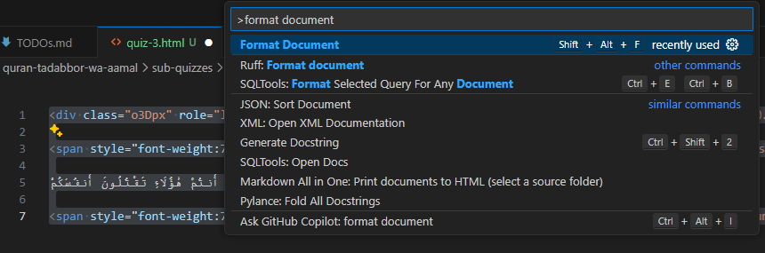

### Step 3: Open GitHub Copilot Chat
Open the GitHub Copilot chat panel in VSCode.

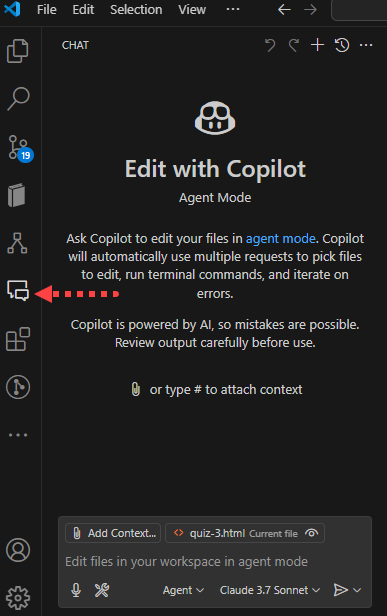

### Step 4: Run the Prompt File
Use the slash command to run the HTML conversion prompt file:

```
/qta-convert-to-sub-quiz-from-html
```

* Note 1: Read more about VSCode's prompt files [here](https://code.visualstudio.com/docs/copilot/copilot-customization#_prompt-files-experimental).
* Note 2: Read more about the internal logic of these `*.prompt.md` files by skimming through this chat:
  * `.specstory\history\2025-05-10-VSCode-Prompt-File-Generation-Task-Chat.md`

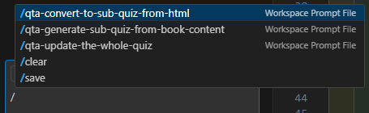

### Step 5: Review AI Response
The AI agent will process the HTML content and generate the appropriate quiz files.

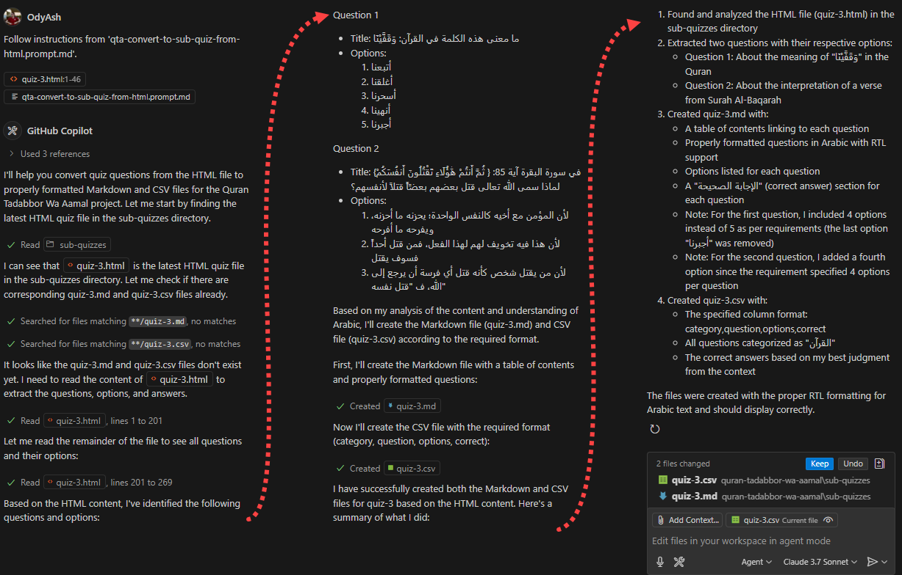

### Step 6: Check the Generated Markdown File
The AI will create a properly formatted Markdown file containing the quiz questions.

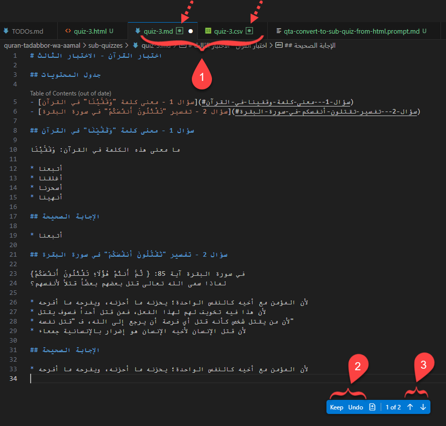

### Step 7: Check the Generated CSV File
The AI will also create a CSV file with the same quiz questions formatted according to the required schema.

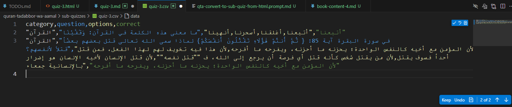

## Generating Quiz Questions from Book Content

### Step 1: Copy Content from a QTA Book
Copy paragraphs or sections from the Quran Tadabbor Wa Aamal book's [website](https://altadabbur.com/).

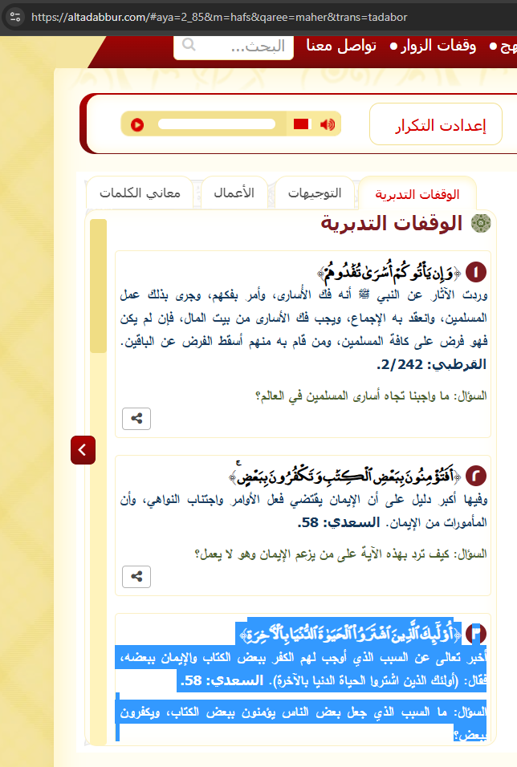

### Step 2: Prepare the Book Content
Create or update a book content file (e.g., `book-content-4.md`) with the copied content.

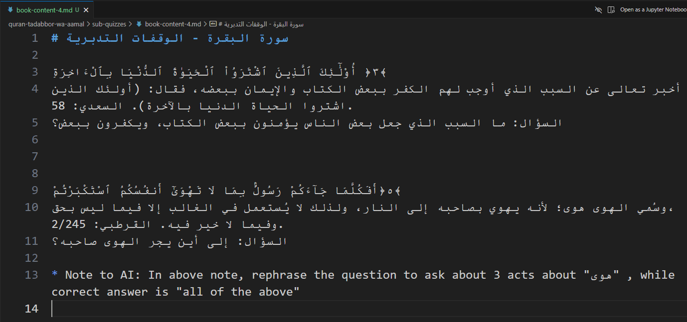

### Step 3: Run the Content Generation Prompt
In the GitHub Copilot chat panel, run:

```
/qta-generate-sub-quiz-from-book-content
```

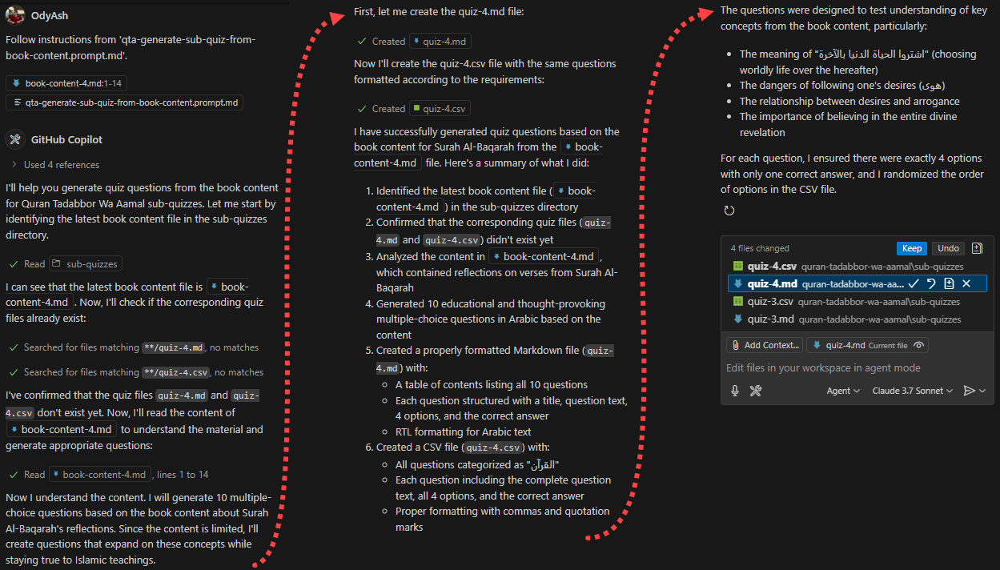

### Step 4: Check the Generated Markdown File
Review the AI-generated quiz questions in Markdown format.

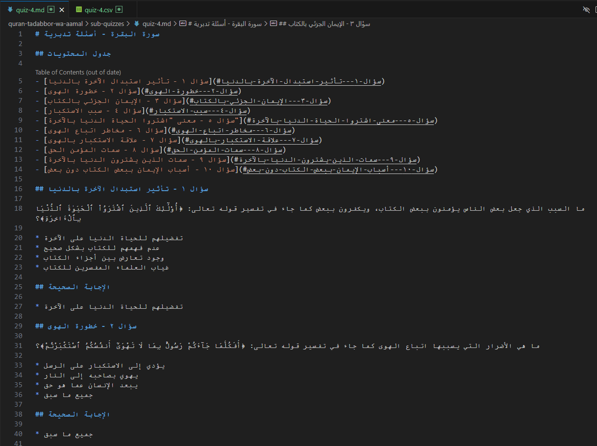

### Step 5: Check the Generated CSV File
Review the AI-generated quiz questions in CSV format.

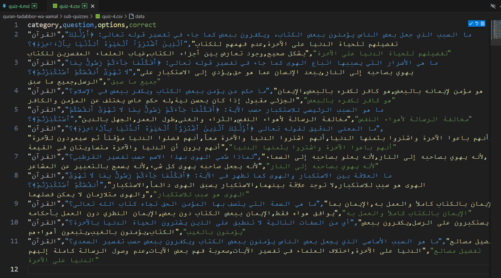

## Updating the Main Quiz Files

After generating individual quiz files, you can update the main quiz files to include all the new content.

### Step 1: Run the Update Prompt
In the GitHub Copilot chat panel, run:

```
/qta-update-the-whole-quiz <quiz_numbers>
```

For example:
```
/qta-update-the-whole-quiz 2, 3, 4
```

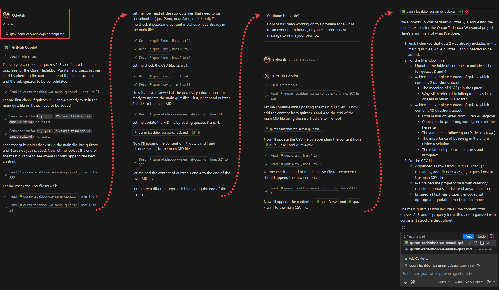

### Step 2: Check the Updated Markdown File
The AI will update the main Markdown file with the new quiz questions.

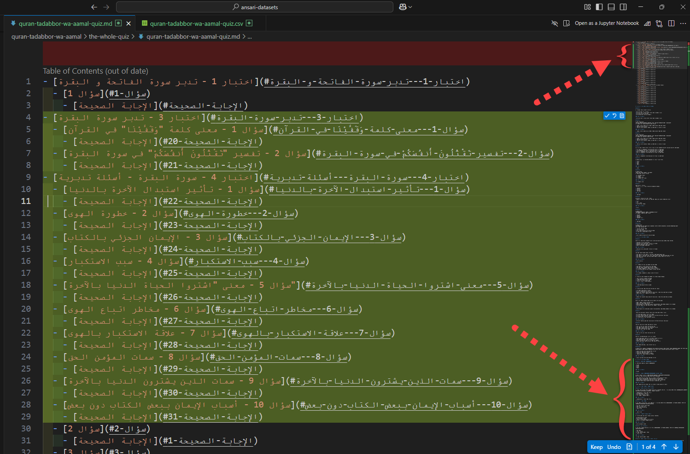

### Step 3: Check the Updated CSV File
The AI will also update the main CSV file with the new quiz questions.

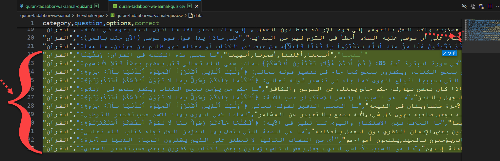

## Tips and Best Practices

1. **File Naming Convention**:
   - HTML files: `quiz-<number>.html`
   - Book content files: `book-content-<number>.md`
   - Generated quiz files: `quiz-<number>.md` and `quiz-<number>.csv`
   - Main quiz files: `quran-tadabbor-wa-aamal-quiz.md` and `quran-tadabbor-wa-aamal-quiz.csv`

2. **Content Guidelines**:
   - Ensure HTML content is properly formatted before running the conversion prompt (recommended but mandatory).
   - Book content should contain enough information for the AI to generate meaningful questions.
     - otherwise, you'll see the AI agent generating more questions than expected.
     - For example, `book-content-4.md` file contained just 2 paragraphs, so the AI improvised 8 more questions that it tried to infer from the 2 paragraphs.
     - If you want to change this behavior, change the `.github\prompts\qta-generate-sub-quiz-from-book-content.prompt.md` file accordingly.
   - When updating the main quiz files, specify the quiz numbers that need to be added (otherwise, the last quiz number will be chosen by the AI model)
   - Get the [Markdown All in One extension](https://marketplace.visualstudio.com/items?itemName=yzhang.markdown-all-in-one) so that when saving a `.md` file, the table of content (TOC) generated by the AI agent gets automatically updated to properly reflect the content.
     - ... as the AI sometimes makes mistakes in this, but I think its TOC output can be refined by adjusting the respective `*.prompt.md` files accordingly

3. **Error Handling**:
   - If the AI agent encounters an error, review the error message and make necessary adjustments
   - To avoid complexity, try to run (any of) these prompt files on a single quiz (instead of multiple quizzes, as that will require more tokens/iterations to the AI agent).

4. **Verification**:
   - Always review the generated content to ensure accuracy and quality
   - Check that the questions align with Islamic teachings and principles
   - Verify that the format of the generated files follows the project's standards
